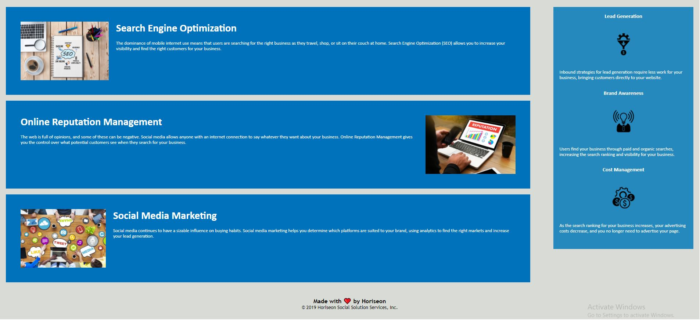

# *Horiseon - Search-Engine Optimization and Cleanup*
The following implementation is aimed at providing proper webpage accessibility for disabled persons in addition to including several minor modifications to increase site performance in organic search results.

### *Additions*
*Search-Engine Optimization*
* Title addition
    * Changed from 'Website' to 'Horiseon'
* Alt. text included for the following images:
    * Office Meeting Collaboration
    * Search Engine Optimization Cloud Chart
    * Laptop Showing Increasing Reputation
    * Social Media Marketing Buzzword Bubble Chart
    * Lead churning funnels into profit
    * Show your brands light to increase exposure
    * Funding search engine optimization upfront overtime reduces your company costs

### *Cleanup*
*Code Base*
* Corrected search-engine-optimization href to correctly link with Search Engine Optimization \
 (line 16)
* Code structure modified for improved legibility

*Semantic Elements*
* \<nav> element added to encapsulate Nav Bar (lines 13/25)

*Imagery*
* The following .jpgs downsized to increase page load speed:
    * digital-marketing-meeting.jpg
    * online-reputation-management.jpg
    * search-engine-optimization.jpg
    * social-media-marketing.jpg

### *Screenshots*

    

